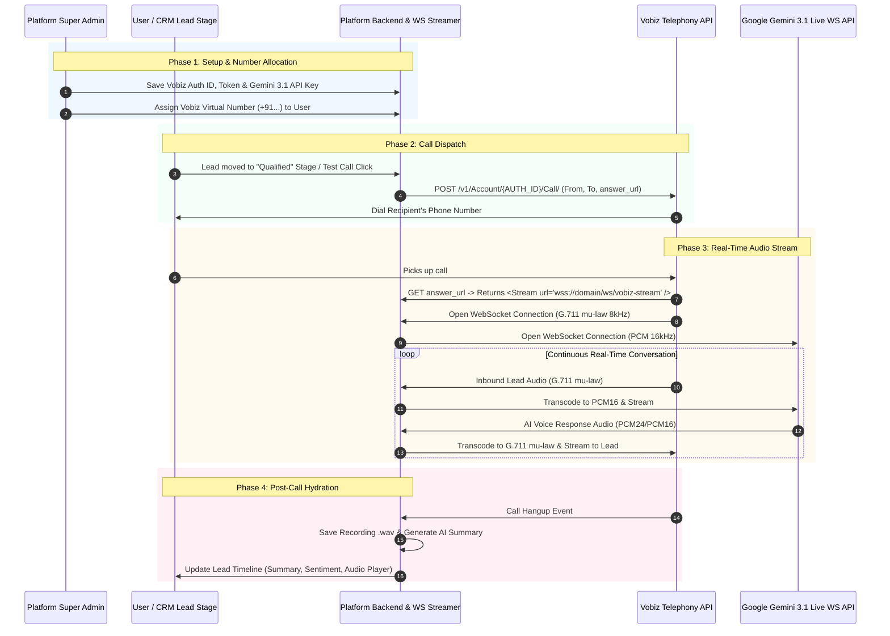

# 🎙️ Standalone Self-Hosted AI Voice Engine Implementation Guide
### (Vobiz Telephony + Google Gemini 3.1 Flash Live Preview API)

> **Universal Technical Blueprint & Master Prompt** for integrating a 100% independent, self-hosted real-time AI Voice Calling Platform into any Web Application, CRM, or SaaS platform without relying on third-party middleware SaaS vendors.

---

## 📌 Executive Summary & Goals

This guide enables any development team or AI coding assistant (Cursor, Antigravity IDE, Windsurf, Claude) to build a native, full-duplex AI Voice Calling system.

### Key Capabilities:
- **Zero Third-Party Middleware**: Directly connects Vobiz Telephony API to Google Gemini 3.1 Flash Live Preview.
- **Super Admin Central Control**: Admin manages Vobiz Auth Credentials, Gemini API Key, and assigns virtual phone numbers to users.
- **Automated CRM Pipeline Triggers**: Moving a lead to configured pipeline stages (e.g. `Qualified`, `New`) automatically dispatches an AI Voice call.
- **Real-Time Bidirectional Streaming**: Ultra-low latency voice conversation with real-time user interruption support.
- **Post-Call Analytics**: Audio recordings, AI summaries, and sentiment scores automatically sync to lead timelines.

---

## 🏗️ 1. Architecture Overview & Sequence Diagram



---

## 🗄️ 2. Database Schema & Data Models

### 2.1 System Settings Table / Entity
| Field Name | Type | Description |
| :--- | :--- | :--- |
| `vobiz_auth_id` | String | Vobiz Account Auth ID |
| `vobiz_auth_token` | String | Vobiz Account Auth Token |
| `gemini_api_key` | String | Google AI Studio Gemini 3.1 API Key |

### 2.2 User / Client Table / Entity
| Field Name | Type | Description |
| :--- | :--- | :--- |
| `assigned_caller_number` | String | Assigned Vobiz virtual number (e.g. `+9198111XXXXX`) |
| `ai_calling_enabled` | Boolean | Flag to enable/disable AI calling for the user |
| `ai_voice_name` | String | Selected Gemini voice (`Aoede`, `Zephyr`, `Charon`, `Kore`) |
| `system_prompt` | Text | Custom AI agent persona instructions |
| `trigger_stages` | Array/JSON | Pipeline stages that trigger automated calls |

### 2.3 Lead / Activity Table / Entity
| Field Name | Type | Description |
| :--- | :--- | :--- |
| `call_recording_url` | String | URL of the saved `.wav` audio recording |
| `call_summary` | Text | AI-generated bullet point summary of conversation |
| `call_sentiment` | String | Sentiment score (`positive`, `neutral`, `negative`) |
| `call_duration_seconds` | Integer | Total duration of call in seconds |

---

## 🖥️ 3. Frontend UI Specifications

### 3.1 Super Admin Settings Panel
- **Card Title**: `📞 Telephony & AI Voice Engine Credentials`
- **Fields**:
  - `Vobiz Auth ID` (Password/Text Input)
  - `Vobiz Auth Token` (Password/Text Input)
  - `Gemini 3.1 Flash Live API Key` (Password Input)
- **User Allocation Modal**:
  - `Assigned Vobiz Number` input field per user.
  - `Enable AI Calling` toggle switch.

### 3.2 User Dashboard (`/calling-agent` or Settings)
- **Provider Badge**: `🤖 Native AI Voice Engine (Vobiz + Gemini 3.1 Live)`
- **Caller Number**: Read-only display of `assigned_caller_number`.
- **Voice Selector**: Dropdown (`Aoede - Female`, `Zephyr - Male`, `Charon - Male`, `Kore - Female`).
- **Persona Instruction Editor**: Textarea for defining AI behavior.
- **Stage Triggers**: Checkboxes for CRM stages (`New`, `Qualified`, `Proposition`, `Won`).
- **Telephony Sandbox**: Test recipient number input & `📞 Place Test Call` button.

---

## ⚙️ 4. Backend Engine Implementation Details

### Step 1: Outbound Call Dispatcher
When a call is triggered (via pipeline change or sandbox test):
```http
POST https://api.vobiz.ai/v1/Account/{VOBIZ_AUTH_ID}/Call/
Authorization: Basic Base64(VOBIZ_AUTH_ID:VOBIZ_AUTH_TOKEN)
Content-Type: application/json

{
  "from": "+9198111XXXXX",
  "to": "+919876543210",
  "answer_url": "https://yourdomain.com/api/vobiz/answer-xml?leadId=123",
  "hangup_url": "https://yourdomain.com/api/vobiz/hangup"
}
```

### Step 2: Vobiz XML Answer Endpoint
Endpoint: `GET /api/vobiz/answer-xml`
Returns Vobiz XML instructing Vobiz to connect the audio stream:
```xml
<?xml version="1.0" encoding="UTF-8"?>
<Response>
  <Stream bidirectional="true" keepCallAlive="true">wss://yourdomain.com/ws/vobiz-stream?leadId=123</Stream>
</Response>
```

### Step 3: Bi-directional WebSocket Audio Streamer (`/ws/vobiz-stream`)
1. Open WebSocket connection to Google Gemini 3.1 Live API:
   `wss://generativelanguage.googleapis.com/ws/google.ai.generativelanguage.v1alpha.GenerativeService.BidiGenerateContent?key={GEMINI_API_KEY}`
2. **Audio Transcoding**:
   - Convert Vobiz **G.711 mu-law 8kHz** audio ➔ **PCM 16kHz** ➔ Send to Gemini Live WS.
   - Convert Gemini Live **PCM 24kHz/16kHz** audio ➔ **G.711 mu-law 8kHz** ➔ Stream to Vobiz WS.
3. **Interruption Handling**:
   - If user speaks while Gemini is talking, send Gemini `clearAudio` / interruption event and clear current output audio buffer.
4. **Tool Calling**:
   - Provide function definitions for `hangupCall`. When Gemini calls `hangupCall`, gracefully terminate Vobiz call.

### Step 4: Post-Call Summary & Recording
On call disconnect:
1. Store raw audio stream to `.wav` file on server/S3.
2. Send full transcript to Gemini 1.5/2.0 Flash to extract **Summary** & **Sentiment**.
3. Persist `call_recording_url`, `call_summary`, and `call_sentiment` to Lead Activity record.

---

## 🤖 5. Copy & Paste Master Prompt for AI Coding Assistants
*(Cursor, Antigravity IDE, Windsurf, Claude Code, GitHub Copilot)*

Copy and paste the block below into any codebase's AI Agent:

```markdown
Build a 100% Standalone Self-Hosted AI Voice Calling Engine in our project using Vobiz Telephony API and Google Gemini 3.1 Flash Live Preview API.

Please inspect our repository and implement the following architecture:

### 1. Database & Schema Updates:
- Add `vobiz_auth_id`, `vobiz_auth_token`, and `gemini_api_key` to Global Admin Configuration.
- Add `assigned_caller_number` (string) and `ai_calling_enabled` (boolean) to User Account model.
- Add `call_recording_url`, `call_summary`, `call_sentiment` to Lead / Activity models.

### 2. Admin & User UI:
- In Super Admin Settings: Add UI to save Vobiz Auth ID, Vobiz Token, and Gemini 3.1 API Key, and assign Vobiz caller numbers to users.
- In User Calling Dashboard: Display assigned Vobiz caller number, Gemini voice selector (Aoede, Zephyr, Charon, Kore), System Prompt editor, CRM Stage Triggers checkboxes, and Test Call console.

### 3. Backend Outbound Dispatcher & Answer XML:
- Create Outbound Dispatcher service: `POST https://api.vobiz.ai/v1/Account/{VOBIZ_AUTH_ID}/Call/` using Vobiz Basic Auth.
- Set `answer_url` to `https://<domain>/api/vobiz/answer-xml`.
- Create endpoint `GET /api/vobiz/answer-xml` returning `<Response><Stream bidirectional="true">wss://<domain>/ws/vobiz-stream</Stream></Response>`.

### 4. WebSocket Audio Streamer (`/ws/vobiz-stream`):
- Create WebSocket handler at `/ws/vobiz-stream`.
- Connect bidirectional stream to Gemini 3.1 Live API (`wss://generativelanguage.googleapis.com/ws/google.ai.generativelanguage.v1alpha.GenerativeService.BidiGenerateContent`).
- Handle G.711 mu-law <-> PCM16 audio transcoding, real-time interruption handling, and `hangupCall` tool execution.

### 5. Automation & Post-Call Data Sync:
- Add event listener on Lead stage changes. If stage is checked, trigger outbound call automatically.
- Upon call disconnect, save audio recording `.wav`, generate summary & sentiment via Gemini, and update Lead Timeline in CRM.
```

---

## 🛠️ Verification & Testing Checklist
- [ ] **Super Admin Settings**: Save Vobiz Auth ID, Token & Gemini API Key.
- [ ] **Number Assignment**: Assign Vobiz number to a test user.
- [ ] **Outbound Call Dispatch**: Verify Vobiz REST API returns `200 OK` and dials phone.
- [ ] **Bi-directional Speech**: Verify lead hears Gemini AI voice and Gemini hears lead's voice in real-time.
- [ ] **Interruption**: Verify speaking during AI response immediately stops AI audio.
- [ ] **Post-Call Sync**: Verify recording URL, summary, and sentiment are visible in Lead timeline.
